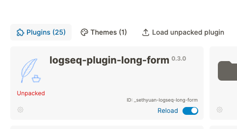

English | [中文](README.zh.md)

# logseq-plugin-hierarchy-jump

Identifies the current page's hierarchy and offer a quicker navigation.

## Feature Highlights

- Support namespace pages.

## How to Install

1. Download the newest zip file from the [Releases](https://github.com/sethyuan/logseq-hierarchy-jump/releases) page.
1. Unzip the zip file into the folder where you want to store the plugin.
1. Turn on the developer mode in Logseq. 
1. Load the unzipped folder (named `logseq-hierarchy-jump`) by clicking on the `Load unpacked plugin` button on the plugins modal. 
1. You should now see the plugin being installed. 

## Usage

https://github.com/sethyuan/logseq-plugin-hierarchy-jump/assets/3410293/de90fe8b-a299-41e2-84fa-662376e6df57

## Join the community

Join the Discord channel [here](https://discord.gg/DHud5TtMSK) where we discuss everything related to the plugin.
