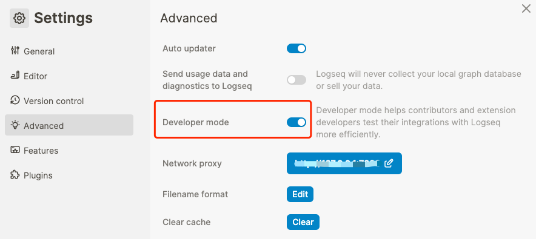

[English](README.md) | 中文

> ⚠️ **警告**
> 
> 此插件与Logseq DB版本不兼容！

# logseq-plugin-hierarchy-jump

识别当前页面的层级结构并提供快速跳转能力。

## 功能特色

- 支持 namespace 页面。
- 支持基于标签层级关系的页面。
- 支持标签层级与 namespace 层级的混合层级。
- 可折叠、展开，方便遍历。
- 可快捷键呼出（命令栏也可以）。
- 展开较长的层级时可自动聚焦到当前页面周围，方便快速定位。

## 如何安装

1. 从 [Releases](https://gitee.com/sethyuan/logseq-hierarchy-jump/releases) 页面下载最新的 zip 文件。
1. 将压缩文件解压到你想要存储插件的文件夹中。
1. 在 Logseq 中开启开发者模式。 
1. 通过插件页面的 `Load unpacked plugin` 按钮加载解压后的文件夹（名为 `logseq-hierarchy-jump`）。 
1. 现在应该已经可以看到插件安装好了。

## 使用展示

https://github.com/sethyuan/logseq-hierarchy-jump/assets/3410293/9ca991c2-0773-4c0d-9747-91d5a5013943

## 加入社群

请扫以下二维码加我微信，我拉您进群。微信群仅用来讨论插件相关主题。

